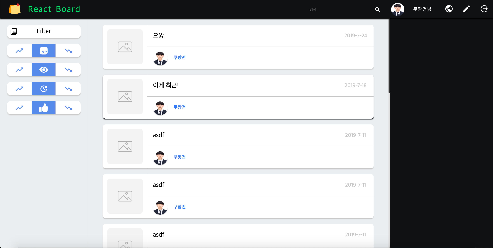

# Community Board developed by React.js

## Installation

~~~
  (!Client Side)

  ./Project Root Diretory

    $git clone https://github.com/HamSungJun/React-Board.git
    $npm install
    $npm run dev ---> localhost:9000

  (!Server Side <= This is local REST)

    $node app.js ---> localhost:3000

  After then, all of Client's Http Requests wiil be sent to localhost:3000/(Some Routes)
~~~

## 개발 내역

#### 2018-11-24  
>불금에 Login.jsx 만들었습니다. Redux 로그인 리듀서에서 입력하는 로그인 Form에 대한 모든 상태 데이터를 관리하고 로그인 로직을 구현해 볼 생각입니다. redux-logger 미들웨어를 적용해 두었기 때문에 개발자 도구 Console에서 데이터 변동 확인가능합니다.

#### 2018-11-28

>화요일 심심한 저녁에 회원가입 폼을 제작하였습니다. 회원가입 모달 스크린은 로그인 박스에 추가된 Register 버튼을 클릭하면 렌더링 됩니다. 자신의 프로필 이미지를 설정할 수 있도록 filepond 파일 업로드 라이브러리를 이용하였습니다.

#### 2018-11-29

>수요일 시간 많은 날에 회원가입 폼을 리덕스 스토어와 연결하였습니다. 입력 인풋 요소들에게는 각각의 정규식을 통해 입력된 값에 대한 검증을 수행하고 유효한 입력이면 State는 true 상태로 변경됩니다. 입력이 유효하지 않을 경우 AlertBox가 Live Append 됩니다. 모든 필요 Boolean State가 만족하게 될때 Submit 버튼이 밝은 초록색으로 이용 가능해 집니다.

#### 2018-12-05

>폼을 작성하게 되면 Submit 버튼을 클릭하여 유저가 입력한 이메일로 가입 인증을 위한 메일을 전송합니다. 메일을 보내는 것은 nodemailer모듈과 ethereal fake SMTP 서비스를 이용하였습니다. 받은 메일에서 유저를 구분하기 위한 Unique Key는 가입한 시각의 Timestamp값을 이용하였습니다. 링크를 클릭하게 되면 서버 고유의 가입 인증을 위한 라우팅 주소로 타임스탬프 값이 전해지며 이것을 MongoDB 다큐먼트의 식별값으로 이용하여 비인증된유저 컬렉션에서 인증된 유저컬렉션으로 다큐먼트를 이동시킵니다.

#### 인증메일 발송

#### 비인증 유저 컬렉션

#### FAKE SMTP

#### 인증 유저 컬렉션

#### 2019-03-05

>모비젠이라는 회사에서 현장실습을 하느라 개발 재개가 늦어졌네요. 로그인 성공시 /Home으로 진입하며 현재 TopBar만 구성되어 있습니다. 현재 이슈는 새로고침시 Redux Store 데이터를 어떻게 직전의 Store값으로 복원 시키느냐와 세션 유지 및 파기 시간 설정입니다. 메뉴 아이콘은 ` react-icons` 를 이용하여 구성하였습니다.

#### Home__TopBar

#### 2019-06-25

>현재 `HTML` 내부 `iframe`을 통해서 에디트 기능을 개발하려 하고 있습니다.

- 개발완료된 내용
    - 텍스트 굵게 처리하는 기능
    - 텍스트 기울임 기능
    - 텍스트 밑줄 기능
    - 텍스트 정렬 기능
    - 하이퍼 링크 기능
    - 텍스트 색상 조절 기능
    - 텍스트 크기 지정 기능
    
- 개발중인 내용
    - 미디어 로더 기능
    > 해당 기능은 파일 브라우저를 통해서 이미지를 선택하면 사이드 패널의 프리뷰 아이콘에 등록되어 마우스 호버시 확대된 이미지 화면을 볼 수 있도록 지원하고 에디트 프레임에 드래그 앤 드랍을 통해서 필요한 곳에 바로 이미지를 삽입할 수 있도록 만들어볼 계획입니다.

#### 2019-06-26

> 이미지를 낱개 혹은 다중으로 `Photo Library` 사이드 바에 프리뷰 상태로 로드할 수 있게 되었습니다. 프리뷰는 서버쪽에 이미지 저장이 성공적으로만 이루어 졌을 경우에 등장하므로 안정성이 높습니다. `Edit Frame`에 로드 되는 상황에서는 서버쪽 경로를 src로 이용합니다.

> 이미지는 라이브러리에 로드시켜 놓는데에 성공하였다면 `Drag & Drop` 유저 액션을 통해 `Edit Frame`에 로드시킬 수 있습니다. 원래 이미지 크기의 1/5 상태로 입력됩니다. 유저의 입맛에 따라 이미지 크기를 수정할 수 있도록 `Resizer`를 구현해 볼 계획 입니다.

- 개발 하려는 기능 
  - `Edit Frame` 내 이미지 사이즈 조절 기능

#### 2019-07-11

- React-Board 리팩토링

  - 불필요한 React-Redux 커넥션 제거.

  - 간단한 State 데이터는 컴포넌트 생성자 내부 this.state = {...} 으로 컨트롤

  - React-Router의 history 로직 추가 (비 로그인시 접근 제어 , 로그아웃 Redirecting)
  
  - 유저 정보를 리덕스 스토어에 저장하는 방식에서 `sessionStorage`에 저장하는 방식으로 변경(새로고침시 데이터가 증발하는 문제. Logout 이벤트에서 Clear())

- 개발 완료된 내용

  - 작성 완료 버튼 클릭시 내용을 서버쪽으로 `POST`

  - SharedPostings 컬렉션에 POST_THUMBNAIL key 추가

  - 로그아웃 버튼 클릭시 세션 스토리지 내용 Clear 및 기본 주소로 이동

- 개발 예정인 내용

  - 유효 세션 인증을 위한 `JSON WEB TOKEN` 도입을 할건데.. (이건좀 나중에)

  - 저장된 포스트를 불러와 렌더링 하는 기능 (READ)

  - 포스트중 하나를 클릭하면 내용을 렌더링 하는 기능 (READ)
  
  - 저장된 포스르를 수정 및 삭제할 수 있는 기능 (UPDATE or DELETE)

#### 2019-07-30

- 개발 완료된 내용

  - 게시글을 중간 작성 할 수 있도록 제작.

  - 중간 저장된 글을 불러와서 이어 작성 할 수 있도록 제작.

  - Home에서 작성된 포스트들을 살펴볼 수 있도록 리스팅.

- 개발 예정 내용

  - 글을 읽을 때 접근하는 장치에 따라 최적화된 뷰를 제공할 수 있어야 함.

  - 반응형 레이아웃 제공 필요.

  - 게시글에 대한 댓글 기능 구현 예정.

#### 글 임시저장 및 불러 오기

#### 게시글 리스팅

#### 게시글 클릭 -> 읽기

> 게시글을 불러올 때 서버에 'GET' 요청을 통해 서버에 존재하는 포스팅을 20개씩 쿼리하여 가져옵니다. 스크롤바가 하단에 닿게되면 추가로 20개씩 요청하는 식으로 페이지네이션을 구현하고 데이터베이스 쿼리할 때 게시글 내용 전체를 가져올까 생각하다가 리스팅에 필요한 내용만 프로젝션하여 가져온후 리스트 중 하나를 클릭하면 해당 포스트의 내용만 쿼리하여 가져옵니다. 사용자가 모든 내용을 읽어보지 않을 것이라 생각하였고 내용까지 가져오면 클라이언트 측이 메모리 용량을 필요치 않게 많이 차지 할 것이라 생각함.

> 게시글 리스팅에 필요한 데이터는 리액트 컴포넌트 State에 저장하지 않고 Redux Store에 저장하였습니다. History 이동시 컴포넌트 Mount , Unmount가 발생하는데 이때 State가 유실되어 한번 요청했던 데이터를 다시 요청하게 되는 상황이 발생하기 때문입니다. Store에 저장하게 되면 다시 요청하고 렌더링하는 작업없이 요청했던 내용을 윈도우를 리로드 하지 않는한 유지 할 수 있음.